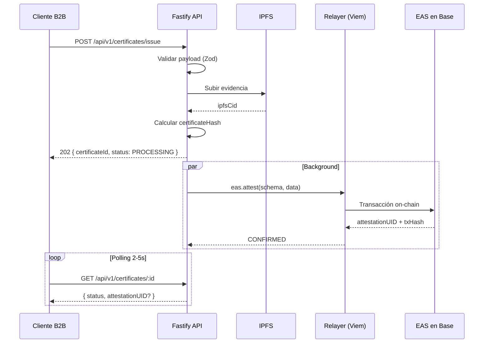

# Documentación de la API — Proofact Impact Certification Service

API REST corporativa (B2B SaaS) para certificar impacto ambiental y social de empresas tradicionales, con attestations inmutables en **Base** mediante **EAS** y capa virtual **EVVM**.

**Repositorio:** https://github.com/FerTello01/API-Angulo

---

## Información general

| Campo | Valor |
|---|---|
| **Base URL (dev)** | `http://localhost:3000` |
| **Guía interactiva (web)** | `http://localhost:3001/developers` |
| **OpenAPI (Scalar)** | `http://localhost:3000/docs` |
| **Spec JSON** | `http://localhost:3000/openapi.json` |
| **Versión** | `v1` |
| **Formato** | JSON (`Content-Type: application/json`) |
| **Host chain** | [Base](https://docs.base.org) (Sepolia `84532` / Mainnet `8453`) |
| **Attestations** | [EAS](https://docs.attest.org/docs/welcome) (predeploy OP Stack) |
| **Virtual chain** | [EVVM](https://www.evvm.info/docs/QuickStart) (opcional, gasless) |

### Principio B2B

El cliente corporativo **no interactúa con Web3**: no maneja llaves privadas, no firma transacciones y no paga gas. La plataforma actúa como **relayer operacional** que firma y cubre el costo del gas en Base.

---

## Tabla de contenidos

- [Guía de implementación](./INTEGRATION.md) — **empezar aquí**
- [Endpoints](#endpoints)
- [Infraestructura on-chain](#infraestructura-on-chain)
- [Configuración previa](#configuración-previa)
- [Autenticación](#autenticación)
- [Convenciones](#convenciones)
- [EAS — Attestations on-chain](#eas--attestations-on-chain)
- [EVVM — Virtual Blockchain](#evvm--virtual-blockchain)
- [Health Check](#health-check)
- [Emitir certificado](#emitir-certificado)
- [Consultar certificado](#consultar-certificado)
- [Estados del certificado](#estados-del-certificado)
- [Códigos de error](#códigos-de-error)
- [Flujo de integración](#flujo-de-integración)
- [Modelos de datos](#modelos-de-datos)
- [Variables de entorno](#variables-de-entorno)
- [Límites y roadmap](#límites-y-roadmap)

---

## Endpoints

| Método | Ruta | Descripción | Respuesta |
|---|---|---|---|
| `GET` | `/health` | Health check del servicio | `200` |
| `POST` | `/api/v1/certificates/issue` | Emitir certificado de impacto | `202` |
| `GET` | `/api/v1/certificates/:id` | Consultar estado del certificado | `200` / `404` |

> Endpoints planificados: listado por `taxId`, revocación EAS, verificación pública por `attestationUID`, webhooks.

---

## Infraestructura on-chain

### Base (host chain)

| Red | Chain ID | RPC | Explorer |
|---|---|---|---|
| Base Sepolia | `84532` | `https://sepolia.base.org` | [sepolia.basescan.org](https://sepolia.basescan.org) |
| Base Mainnet | `8453` | `https://mainnet.base.org` | [basescan.org](https://basescan.org) |

### EAS (predeployado en Base — OP Stack)

No es necesario desplegar EAS manualmente en Base:

| Contrato | Dirección |
|---|---|
| **EAS** | `0x4200000000000000000000000000000000000021` |
| **SchemaRegistry** | `0x4200000000000000000000000000000000000020` |

### Schema de impacto registrado

```
string companyTaxId, string impactCategory, uint256 amount, string ipfsEvidence
```

Registrar con:

```bash
npm run register-schema
```

Ver attestations en:
- Testnet: [base-sepolia.easscan.org](https://base-sepolia.easscan.org)
- Mainnet: [base.easscan.org](https://base.easscan.org)

### EVVM (opcional)

Blockchain virtual sobre Base para flujo gasless vía fishers. Ver [EVVM.md](./EVVM.md) y [DEPLOY-BASE.md](./DEPLOY-BASE.md).

---

## Configuración previa

Antes de consumir la API en un entorno real:

```bash
cp apps/api/.env.example apps/api/.env
# Configurar RELAYER_PRIVATE_KEY

pnpm --filter @proofact/api register-schema   # Obtener EAS_IMPACT_SCHEMA_UID
pnpm --filter @proofact/api check-deployment  # Validar fondos, EAS y schema
pnpm dev                                     # API :3000 + Web :3001
```

| Requisito | Descripción |
|---|---|
| Wallet relayer | Llave privada con ETH en Base Sepolia para gas |
| Schema EAS | UID obtenido tras `register-schema` |
| EVVM (opcional) | Direcciones tras deploy con `evvm-cli` |

Guía completa: **[DEPLOY-BASE.md](./DEPLOY-BASE.md)**

---

## Autenticación

> **Estado actual:** la API no requiere autenticación.

Se recomienda implementar **API keys** o **JWT** antes de exponer en producción. Los endpoints futuros soportarán:

```
Authorization: Bearer <api_key>
```

---

## Convenciones

| Convención | Detalle |
|---|---|
| Emisión exitosa | HTTP `202 Accepted` (procesamiento asíncrono) |
| Consulta exitosa | HTTP `200 OK` |
| Error de validación | HTTP `400 Bad Request` |
| Recurso no encontrado | HTTP `404 Not Found` |
| `certificateId` | UUID v4 — identificador interno de la API |
| `certificateHash` | `bytes32` hex (`0x...`) — hash off-chain determinístico |
| `attestationUID` | `bytes32` hex (`0x...`) — UID EAS on-chain |
| Timestamps | ISO 8601 UTC (`createdAt`, `updatedAt`) |
| Gas | Pagado por el relayer en ETH (Base) |

---

## EAS — Attestations on-chain

API Proofact utiliza **[Ethereum Attestation Service (EAS)](https://docs.attest.org/docs/welcome)** para registrar certificaciones de impacto como attestations verificables en **Base**.

### ¿Qué es una attestation?

Firma digital sobre datos estructurados registrada on-chain. El relayer attesta que una empresa (`companyTaxId`) generó un impacto medible, referenciando evidencia en IPFS.

### Flujo en la API

```
POST /issue → IPFS (CID) → eas.attest() → attestationUID → GET /:id (CONFIRMED)
```

1. Cliente envía `POST /api/v1/certificates/issue`
2. API sube evidencia a IPFS → obtiene `ipfsCid`
3. Relayer ejecuta `eas.attest()` vía Viem en Base
4. EAS retorna `attestationUID` verificable públicamente
5. `GET /api/v1/certificates/:id` incluye `attestationUID` cuando `status: CONFIRMED`

### Verificación pública

| Método | Herramienta |
|---|---|
| Explorer | [Base Sepolia EAS Scan](https://base-sepolia.easscan.org) |
| SDK | `eas.getAttestation(uid)` |
| GraphQL | [EAS GraphQL API](https://docs.attest.org/docs/developer-tools/api) |
| On-chain | `getAttestation(bytes32 uid)` en contrato EAS |

> Detalle técnico: **[EAS.md](./EAS.md)**

---

## EVVM — Virtual Blockchain

**[EVVM](https://www.evvm.info/docs/QuickStart)** es una blockchain virtual desplegada sobre Base. Compatible con EAS y habilita attestations **gasless** vía fishers.

| Componente | Rol |
|---|---|
| **Base** | Host chain — seguridad, finalidad, gas en ETH |
| **EVVM** | Blockchain virtual — sin infraestructura propia |
| **EAS** | Attestations de impacto (predeploy en Base) |
| **Fishers** | Ejecutan transacciones; el cliente B2B no paga gas |
| **API Proofact** | Abstrae todo el flujo Web3 vía REST |

El cliente corporativo **nunca interactúa con EVVM** directamente.

> Guía de despliegue: **[EVVM.md](./EVVM.md)**

---

## Health Check

Verifica que el servicio está en ejecución.

### Request

```http
GET /health
```

### Response `200 OK`

```json
{
  "status": "ok",
  "service": "proofact-impact-certification-api",
  "timestamp": "2026-07-12T08:00:00.000Z"
}
```

### cURL

```bash
curl http://localhost:3000/health
```

---

## Emitir certificado

Registra un nuevo certificado de impacto. Responde de inmediato con `PROCESSING` mientras el relayer procesa la attestation EAS en background.

### Request

```http
POST /api/v1/certificates/issue
Content-Type: application/json
```

### Body

| Campo | Tipo | Requerido | Validación | Descripción |
|---|---|---|---|---|
| `companyTaxId` | `string` | Sí | 3–32 chars, alfanumérico | RFC / identificador fiscal |
| `impactCategory` | `string` | Sí | 2–64 chars | Ej: `carbon_offset` |
| `amount` | `number` \| `string` | Sí | Entero positivo | Cantidad de impacto (unidades base) |
| `evidence` | `object` | No | — | Evidencia de soporte |
| `evidence.description` | `string` | Condicional* | 10–2000 chars | Requerido si se envía `evidence` |
| `evidence.metrics` | `object` | No | — | Métricas clave-valor libres |
| `evidence.attachments` | `string[]` | No | URLs válidas | Enlaces a documentos |
| `metadata` | `object` | No | — | Metadatos del cliente (no van on-chain) |

\* Si se incluye `evidence`, `description` es obligatorio.

### Ejemplo de request

```json
{
  "companyTaxId": "ABC123456XYZ",
  "impactCategory": "carbon_offset",
  "amount": 15000,
  "evidence": {
    "description": "Compensación de 15 toneladas CO2e mediante reforestación en Chiapas, Q1 2026",
    "metrics": {
      "co2e_tons": 15,
      "region": "MX-CHI",
      "methodology": "VCS"
    },
    "attachments": [
      "https://storage.example.com/reports/q1-2026.pdf"
    ]
  },
  "metadata": {
    "internalRef": "CERT-2026-0042",
    "department": "sustainability"
  }
}
```

### Response `202 Accepted`

```json
{
  "certificateId": "a1b2c3d4-e5f6-7890-abcd-ef1234567890",
  "certificateHash": "0x8f3a2b1c4d5e6f708192a3b4c5d6e7f8091a2b3c4d5e6f708192a3b4c5d6e7f8",
  "status": "PROCESSING",
  "ipfsCid": "bafybeig8f3a2b1c4d5e6f708192a3b4c5d6e7f8091a2b3c4d5e6f7a1b2c3d4",
  "message": "Certificate issuance accepted. On-chain attestation is being processed by the relayer."
}
```

| Campo | Tipo | Descripción |
|---|---|---|
| `certificateId` | `string` | UUID para consultar estado (`GET /:id`) |
| `certificateHash` | `string` | Hash `bytes32` off-chain determinístico |
| `status` | `string` | Siempre `"PROCESSING"` en la respuesta inicial |
| `ipfsCid` | `string` | CID de IPFS con evidencia |
| `message` | `string` | Mensaje descriptivo |

### Response `400 Bad Request`

```json
{
  "error": "VALIDATION_ERROR",
  "details": {
    "companyTaxId": ["companyTaxId must be at least 3 characters"],
    "amount": ["amount must be a positive number"]
  }
}
```

### cURL

```bash
curl -X POST http://localhost:3000/api/v1/certificates/issue \
  -H "Content-Type: application/json" \
  -d '{
    "companyTaxId": "ABC123456XYZ",
    "impactCategory": "carbon_offset",
    "amount": 15000,
    "evidence": {
      "description": "Compensación de 15 toneladas CO2e mediante reforestación Q1 2026"
    }
  }'
```

---

## Consultar certificado

Obtiene el estado actual. Usar para **polling** hasta `CONFIRMED` o `FAILED`.

### Request

```http
GET /api/v1/certificates/:id
```

| Parámetro | Tipo | Descripción |
|---|---|---|
| `id` | `string` | UUID (`certificateId` de la emisión) |

### Response `200 OK` — PROCESSING

```json
{
  "id": "a1b2c3d4-e5f6-7890-abcd-ef1234567890",
  "certificateHash": "0x8f3a2b1c4d5e6f708192a3b4c5d6e7f8091a2b3c4d5e6f708192a3b4c5d6e7f8",
  "companyTaxId": "ABC123456XYZ",
  "impactCategory": "carbon_offset",
  "amount": "15000",
  "ipfsCid": "bafybeig8f3a2b1c4d5e6f708192a3b4c5d6e7f8091a2b3c4d5e6f7a1b2c3d4",
  "status": "PROCESSING",
  "createdAt": "2026-07-12T08:00:00.000Z",
  "updatedAt": "2026-07-12T08:00:00.000Z"
}
```

### Response `200 OK` — CONFIRMED

```json
{
  "id": "a1b2c3d4-e5f6-7890-abcd-ef1234567890",
  "certificateHash": "0x8f3a2b1c4d5e6f708192a3b4c5d6e7f8091a2b3c4d5e6f708192a3b4c5d6e7f8",
  "companyTaxId": "ABC123456XYZ",
  "impactCategory": "carbon_offset",
  "amount": "15000",
  "ipfsCid": "bafybeig8f3a2b1c4d5e6f708192a3b4c5d6e7f8091a2b3c4d5e6f7a1b2c3d4",
  "status": "CONFIRMED",
  "attestationUID": "0xff08bbf3d3e6e0992fc70ab9b9370416be59e87897c3d42b20549901d2cccc3e",
  "txHash": "0xabc123def4567890abcdef1234567890abcdef1234567890abcdef1234567890",
  "blockNumber": "1234567",
  "createdAt": "2026-07-12T08:00:00.000Z",
  "updatedAt": "2026-07-12T08:00:05.000Z"
}
```

| Campo | Presente cuando | Descripción |
|---|---|---|
| `attestationUID` | `CONFIRMED` | UID único EAS — verificable en EAS Scan |
| `txHash` | `CONFIRMED` | Hash de la transacción en Base |
| `blockNumber` | `CONFIRMED` | Bloque de confirmación en Base |

### Response `200 OK` — FAILED

```json
{
  "id": "a1b2c3d4-e5f6-7890-abcd-ef1234567890",
  "certificateHash": "0x8f3a2b1c4d5e6f708192a3b4c5d6e7f8091a2b3c4d5e6f708192a3b4c5d6e7f8",
  "companyTaxId": "ABC123456XYZ",
  "impactCategory": "carbon_offset",
  "amount": "15000",
  "ipfsCid": "bafybeig8f3a2b1c4d5e6f708192a3b4c5d6e7f8091a2b3c4d5e6f7a1b2c3d4",
  "status": "FAILED",
  "errorMessage": "Relayer wallet has insufficient ETH on Base for gas",
  "createdAt": "2026-07-12T08:00:00.000Z",
  "updatedAt": "2026-07-12T08:00:03.000Z"
}
```

### Response `404 Not Found`

```json
{
  "error": "NOT_FOUND",
  "message": "Certificate a1b2c3d4-e5f6-7890-abcd-ef1234567890 not found"
}
```

### cURL

```bash
curl http://localhost:3000/api/v1/certificates/a1b2c3d4-e5f6-7890-abcd-ef1234567890
```

---

## Estados del certificado

```
PROCESSING ──► CONFIRMED
     │
     └──────► FAILED
```

| Estado | Descripción |
|---|---|
| `PROCESSING` | Aceptado. Evidencia en IPFS. Attestation EAS en curso. |
| `CONFIRMED` | Attestation confirmada en Base. Incluye `attestationUID`, `txHash`, `blockNumber`. |
| `FAILED` | Attestation falló. Ver `errorMessage`. |

### Polling recomendado

1. Guardar `certificateId` tras recibir `202`
2. Consultar `GET /api/v1/certificates/:id` cada **2–5 segundos**
3. Detener cuando `status` sea `CONFIRMED` o `FAILED`
4. Timeout sugerido: **120 s** (alineado con `TX_TIMEOUT_MS`)

---

## Códigos de error

### Errores HTTP

| HTTP | Código | Causa |
|---|---|---|
| `400` | `VALIDATION_ERROR` | Payload inválido |
| `404` | `NOT_FOUND` | `certificateId` no existe |

### Errores on-chain (`errorMessage` en `FAILED`)

| Código interno | Descripción | Acción |
|---|---|---|
| `CONFIG_ERROR` | `EAS_IMPACT_SCHEMA_UID` no configurado | `npm run register-schema` |
| `INSUFFICIENT_FUNDS` | Relayer sin ETH en Base | Recargar wallet ([faucet](https://www.alchemy.com/faucets/base-sepolia)) |
| `TX_TIMEOUT` | Timeout de red Base | Verificar `BASE_RPC_URL` |
| `TX_REVERTED` | EAS rechazó la transacción | Verificar schema UID y permisos |
| `GAS_ESTIMATION_FAILED` | Simulación falló | Revisar parámetros y contrato EAS |
| `NETWORK_ERROR` | Error de conectividad RPC | Verificar `BASE_RPC_URL` |
| `UNKNOWN` | Error no clasificado | Revisar logs del servidor |

---

## Flujo de integración



### JavaScript

```javascript
const API_BASE = 'http://localhost:3000';

async function emitirCertificado(datos) {
  const res = await fetch(`${API_BASE}/api/v1/certificates/issue`, {
    method: 'POST',
    headers: { 'Content-Type': 'application/json' },
    body: JSON.stringify(datos),
  });

  if (!res.ok) throw new Error(`HTTP ${res.status}`);
  const { certificateId } = await res.json();

  for (let i = 0; i < 30; i++) {
    await new Promise((r) => setTimeout(r, 4000));

    const statusRes = await fetch(`${API_BASE}/api/v1/certificates/${certificateId}`);
    const cert = await statusRes.json();

    if (cert.status === 'CONFIRMED') return cert;
    if (cert.status === 'FAILED') throw new Error(cert.errorMessage);
  }

  throw new Error('Timeout esperando confirmación on-chain');
}
```

### Python

```python
import time
import requests

API_BASE = "http://localhost:3000"

def emitir_certificado(datos: dict) -> dict:
    res = requests.post(f"{API_BASE}/api/v1/certificates/issue", json=datos)
    res.raise_for_status()
    certificate_id = res.json()["certificateId"]

    for _ in range(30):
        time.sleep(4)
        cert = requests.get(f"{API_BASE}/api/v1/certificates/{certificate_id}").json()

        if cert["status"] == "CONFIRMED":
            return cert
        if cert["status"] == "FAILED":
            raise RuntimeError(cert.get("errorMessage", "Attestation failed"))

    raise TimeoutError("Timeout esperando confirmación on-chain")
```

---

## Modelos de datos

### IssueCertificateRequest

```typescript
interface IssueCertificateRequest {
  companyTaxId: string;
  impactCategory: string;
  amount: number | string;
  evidence?: {
    description: string;
    metrics?: Record<string, string | number | boolean>;
    attachments?: string[];
  };
  metadata?: Record<string, unknown>;
}
```

### IssueCertificateResponse (`202`)

```typescript
interface IssueCertificateResponse {
  certificateId: string;
  certificateHash: `0x${string}`;
  status: 'PROCESSING';
  ipfsCid: string;
  message: string;
}
```

### CertificateRecord (`200`)

```typescript
type CertificateStatus = 'PROCESSING' | 'CONFIRMED' | 'FAILED';

interface CertificateRecord {
  id: string;
  certificateHash: `0x${string}`;
  companyTaxId: string;
  impactCategory: string;
  amount: string;
  ipfsCid: string;
  status: CertificateStatus;
  attestationUID?: `0x${string}`;
  txHash?: `0x${string}`;
  blockNumber?: string;
  errorMessage?: string;
  createdAt: string;
  updatedAt: string;
}
```

### Attestation EAS (on-chain en Base)

Schema:

```
string companyTaxId, string impactCategory, uint256 amount, string ipfsEvidence
```

| Campo EAS | Tipo | Descripción |
|---|---|---|
| `uid` | `bytes32` | `attestationUID` |
| `schema` | `bytes32` | UID del schema ImpactCertification |
| `attester` | `address` | Wallet del relayer |
| `time` | `uint64` | Timestamp on-chain |
| `revocable` | `bool` | `true` — permite revocación futura |
| `data` | `bytes` | Datos codificados del schema |

### certificateHash (off-chain)

```
keccak256(abi.encodePacked(
  companyTaxId,
  impactCategory,
  amount,
  ipfsHash,
  nonce
))
```

---

## Variables de entorno

| Variable | Requerida | Default | Descripción |
|---|---|---|---|
| `BASE_NETWORK` | No | `sepolia` | `sepolia` o `mainnet` |
| `BASE_RPC_URL` | No | RPC público Base | Endpoint JSON-RPC |
| `RELAYER_PRIVATE_KEY` | **Sí** | — | Wallet que firma y paga gas |
| `EAS_CONTRACT_ADDRESS` | No | `0x4200...0021` | EAS predeploy Base |
| `EAS_SCHEMA_REGISTRY_ADDRESS` | No | `0x4200...0020` | SchemaRegistry predeploy |
| `EAS_IMPACT_SCHEMA_UID` | **Sí*** | — | UID del schema registrado |
| `EVVM_CORE_ADDRESS` | No | — | Contrato EVVM (opcional) |
| `EVVM_STAKING_ADDRESS` | No | — | Staking EVVM (opcional) |
| `EVVM_ID` | No | `0` | ID en EVVM Registry |
| `TX_TIMEOUT_MS` | No | `120000` | Timeout de transacción |
| `TX_MAX_RETRIES` | No | `3` | Reintentos ante fallos de red |

\* Requerida para emitir attestations. Obtener con `npm run register-schema`.

---

## Categorías de impacto sugeridas

| Categoría | Descripción |
|---|---|
| `carbon_offset` | Compensación de emisiones de carbono |
| `water_restoration` | Restauración y conservación de agua |
| `reforestation` | Reforestación y conservación forestal |
| `renewable_energy` | Energía renovable |
| `waste_reduction` | Reducción y reciclaje de residuos |
| `biodiversity` | Protección de biodiversidad |
| `social_impact` | Impacto social comunitario |

> No están restringidas en la API — son convenciones recomendadas.

---

## Límites y roadmap

### Limitaciones actuales

| Aspecto | Estado |
|---|---|
| Almacenamiento | In-memory — se pierde al reiniciar |
| IPFS | Mock — CID simulado |
| Autenticación | No implementada |
| Rate limiting | No implementado |
| Idempotencia | No implementada |
| EVVM gasless | Documentado — integración pendiente |

### Roadmap de endpoints

| Endpoint | Estado |
|---|---|
| `GET /api/v1/certificates?taxId=` | Planificado |
| `POST /api/v1/certificates/:id/revoke` | Planificado |
| `GET /api/v1/attestations/:uid/verify` | Planificado |
| `POST /api/v1/webhooks` | Planificado |
| `GET /docs` (OpenAPI Scalar) | **Implementado** — `http://localhost:3000/docs` |
| `GET /openapi.json` | **Implementado** |
| Guía web `/developers` | **Implementado** — `http://localhost:3001/developers` |

---

## Documentación relacionada

| Documento | Contenido |
|---|---|
| [Guía web /developers](http://localhost:3001/developers) | Documentación narrativa Proofact |
| [DEPLOY-BASE.md](./DEPLOY-BASE.md) | Despliegue Base + EVVM + EAS |
| [EAS.md](./EAS.md) | Integración técnica EAS |
| [EVVM.md](./EVVM.md) | Despliegue EVVM sobre Base |
| [README.md](../README.md) | Overview del proyecto |
