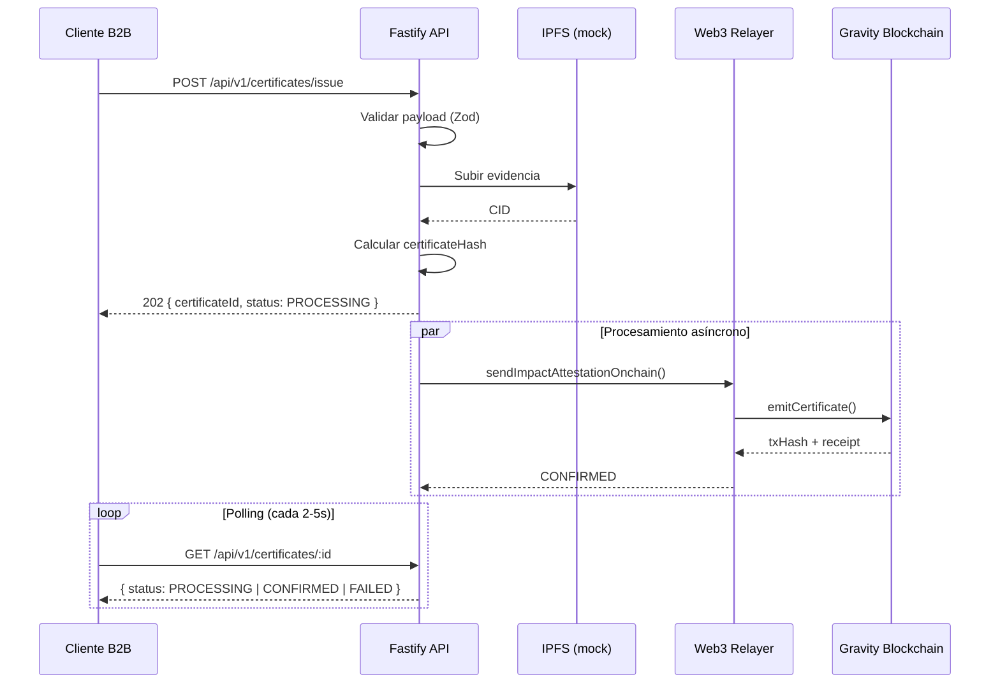

# Documentación de la API — Impact Certification Service

**Base URL:** `http://localhost:3000` (desarrollo)

**Versión:** `v1`

**Formato:** JSON (`Content-Type: application/json`)

---

## Tabla de contenidos

- [Autenticación](#autenticación)
- [Convenciones](#convenciones)
- [Health Check](#health-check)
- [Emitir certificado](#emitir-certificado)
- [Consultar certificado](#consultar-certificado)
- [Estados del certificado](#estados-del-certificado)
- [Códigos de error](#códigos-de-error)
- [Flujo completo de integración](#flujo-completo-de-integración)
- [Modelos de datos](#modelos-de-datos)

---

## Autenticación

> La versión actual no requiere autenticación. Se recomienda implementar API keys o JWT antes de exponer en producción.

---

## Convenciones

| Convención | Detalle |
|---|---|
| Respuestas exitosas de emisión | HTTP `202 Accepted` (procesamiento asíncrono) |
| Respuestas de consulta | HTTP `200 OK` |
| Errores de validación | HTTP `400 Bad Request` |
| Recurso no encontrado | HTTP `404 Not Found` |
| IDs de certificado | UUID v4 (`certificateId`) |
| Hashes on-chain | Hex string con prefijo `0x` (`certificateHash`) |
| Timestamps | ISO 8601 UTC (`createdAt`, `updatedAt`) |

---

## Health Check

Verifica que el servicio está en ejecución.

### Request

```
GET /health
```

### Response `200 OK`

```json
{
  "status": "ok",
  "service": "impact-certification-api",
  "timestamp": "2026-07-12T08:00:00.000Z"
}
```

### Ejemplo cURL

```bash
curl http://localhost:3000/health
```

---

## Emitir certificado

Registra un nuevo certificado de impacto corporativo. La API responde de inmediato con estado `PROCESSING` mientras el relayer procesa la transacción on-chain en background.

### Request

```
POST /api/v1/certificates/issue
```

#### Headers

| Header | Valor | Requerido |
|---|---|---|
| `Content-Type` | `application/json` | Sí |

#### Body

| Campo | Tipo | Requerido | Descripción |
|---|---|---|---|
| `companyTaxId` | `string` | Sí | Identificador fiscal corporativo (RFC). 3–32 caracteres alfanuméricos. |
| `impactCategory` | `string` | Sí | Categoría de impacto. 2–64 caracteres. Ej: `carbon_offset`, `water_restoration`. |
| `amount` | `number` \| `string` | Sí | Cantidad de impacto en unidades base (entero positivo). |
| `evidence` | `object` | No | Evidencia y metadatos de soporte. |
| `evidence.description` | `string` | Condicional* | Descripción de la evidencia. 10–2000 caracteres. Requerido si se envía `evidence`. |
| `evidence.metrics` | `object` | No | Métricas adicionales (clave-valor libre). |
| `evidence.attachments` | `string[]` | No | URLs de documentos adjuntos. |
| `metadata` | `object` | No | Metadatos libres del cliente (no se escriben on-chain). |

\* Si se incluye el objeto `evidence`, `description` es obligatorio.

#### Ejemplo de request

```json
{
  "companyTaxId": "ABC123456XYZ",
  "impactCategory": "carbon_offset",
  "amount": 15000,
  "evidence": {
    "description": "Compensación de 15 toneladas CO2e mediante reforestación en Chiapas, Q1 2026",
    "metrics": {
      "co2e_tons": 15,
      "region": "MX-CHI",
      "methodology": "VCS"
    },
    "attachments": [
      "https://storage.example.com/reports/q1-2026.pdf"
    ]
  },
  "metadata": {
    "internalRef": "CERT-2026-0042",
    "department": "sustainability"
  }
}
```

### Response `202 Accepted`

```json
{
  "certificateId": "a1b2c3d4-e5f6-7890-abcd-ef1234567890",
  "certificateHash": "0x8f3a2b1c4d5e6f708192a3b4c5d6e7f8091a2b3c4d5e6f708192a3b4c5d6e7f8",
  "status": "PROCESSING",
  "ipfsCid": "bafybeig8f3a2b1c4d5e6f708192a3b4c5d6e7f8091a2b3c4d5e6f7a1b2c3d4",
  "message": "Certificate issuance accepted. On-chain attestation is being processed by the relayer."
}
```

| Campo | Tipo | Descripción |
|---|---|---|
| `certificateId` | `string` | UUID único para consultar el estado posteriormente. |
| `certificateHash` | `string` | Hash `bytes32` que indexa el certificado en el contrato. |
| `status` | `string` | Siempre `"PROCESSING"` en la respuesta inicial. |
| `ipfsCid` | `string` | CID de IPFS donde se almacenó la evidencia. |
| `message` | `string` | Mensaje descriptivo del estado. |

### Response `400 Bad Request` — Validación

```json
{
  "error": "VALIDATION_ERROR",
  "details": {
    "companyTaxId": ["companyTaxId must be at least 3 characters"],
    "amount": ["amount must be a positive number"]
  }
}
```

### Ejemplo cURL

```bash
curl -X POST http://localhost:3000/api/v1/certificates/issue \
  -H "Content-Type: application/json" \
  -d '{
    "companyTaxId": "ABC123456XYZ",
    "impactCategory": "carbon_offset",
    "amount": 15000,
    "evidence": {
      "description": "Compensación de 15 toneladas CO2e mediante reforestación Q1 2026"
    }
  }'
```

---

## Consultar certificado

Obtiene el estado actual de un certificado emitido previamente. Usar para polling hasta que el estado sea `CONFIRMED` o `FAILED`.

### Request

```
GET /api/v1/certificates/:id
```

#### Parámetros de ruta

| Parámetro | Tipo | Descripción |
|---|---|---|
| `id` | `string` | UUID del certificado (`certificateId` devuelto en la emisión). |

### Response `200 OK` — En procesamiento

```json
{
  "id": "a1b2c3d4-e5f6-7890-abcd-ef1234567890",
  "certificateHash": "0x8f3a2b1c4d5e6f708192a3b4c5d6e7f8091a2b3c4d5e6f708192a3b4c5d6e7f8",
  "companyTaxId": "ABC123456XYZ",
  "impactCategory": "carbon_offset",
  "amount": "15000",
  "ipfsCid": "bafybeig8f3a2b1c4d5e6f708192a3b4c5d6e7f8091a2b3c4d5e6f7a1b2c3d4",
  "status": "PROCESSING",
  "createdAt": "2026-07-12T08:00:00.000Z",
  "updatedAt": "2026-07-12T08:00:00.000Z"
}
```

### Response `200 OK` — Confirmado on-chain

```json
{
  "id": "a1b2c3d4-e5f6-7890-abcd-ef1234567890",
  "certificateHash": "0x8f3a2b1c4d5e6f708192a3b4c5d6e7f8091a2b3c4d5e6f708192a3b4c5d6e7f8",
  "companyTaxId": "ABC123456XYZ",
  "impactCategory": "carbon_offset",
  "amount": "15000",
  "ipfsCid": "bafybeig8f3a2b1c4d5e6f708192a3b4c5d6e7f8091a2b3c4d5e6f7a1b2c3d4",
  "status": "CONFIRMED",
  "txHash": "0xabc123def4567890abcdef1234567890abcdef1234567890abcdef1234567890",
  "blockNumber": "1234567",
  "createdAt": "2026-07-12T08:00:00.000Z",
  "updatedAt": "2026-07-12T08:00:05.000Z"
}
```

### Response `200 OK` — Fallido

```json
{
  "id": "a1b2c3d4-e5f6-7890-abcd-ef1234567890",
  "certificateHash": "0x8f3a2b1c4d5e6f708192a3b4c5d6e7f8091a2b3c4d5e6f708192a3b4c5d6e7f8",
  "companyTaxId": "ABC123456XYZ",
  "impactCategory": "carbon_offset",
  "amount": "15000",
  "ipfsCid": "bafybeig8f3a2b1c4d5e6f708192a3b4c5d6e7f8091a2b3c4d5e6f7a1b2c3d4",
  "status": "FAILED",
  "errorMessage": "Relayer wallet has insufficient G tokens for gas",
  "createdAt": "2026-07-12T08:00:00.000Z",
  "updatedAt": "2026-07-12T08:00:03.000Z"
}
```

### Response `404 Not Found`

```json
{
  "error": "NOT_FOUND",
  "message": "Certificate a1b2c3d4-e5f6-7890-abcd-ef1234567890 not found"
}
```

### Ejemplo cURL

```bash
curl http://localhost:3000/api/v1/certificates/a1b2c3d4-e5f6-7890-abcd-ef1234567890
```

---

## Estados del certificado

```
PROCESSING ──► CONFIRMED
     │
     └──────► FAILED
```

| Estado | Descripción |
|---|---|
| `PROCESSING` | Certificado aceptado. Evidencia en IPFS. Transacción on-chain en curso. |
| `CONFIRMED` | Transacción confirmada en Gravity. Incluye `txHash` y `blockNumber`. |
| `FAILED` | La attestation on-chain falló. Ver `errorMessage` para diagnóstico. |

### Estrategia de polling recomendada

1. Tras recibir `202`, guardar el `certificateId`
2. Consultar `GET /api/v1/certificates/:id` cada **2–5 segundos**
3. Detener polling cuando `status` sea `CONFIRMED` o `FAILED`
4. Timeout sugerido: **120 segundos** (alineado con `TX_TIMEOUT_MS`)

---

## Códigos de error

### Errores HTTP

| Código | Error | Causa |
|---|---|---|
| `400` | `VALIDATION_ERROR` | Payload inválido (campos faltantes, formato incorrecto). |
| `404` | `NOT_FOUND` | `certificateId` no existe en el store. |

### Errores on-chain (en `errorMessage` cuando `status: FAILED`)

| Código interno | Descripción | Acción sugerida |
|---|---|---|
| `INSUFFICIENT_FUNDS` | Wallet relayer sin saldo en G para gas | Recargar la wallet operacional |
| `TX_TIMEOUT` | Timeout de red Gravity | Reintentar; verificar RPC |
| `TX_REVERTED` | Contrato rechazó la transacción | Verificar duplicado de hash o permisos del relayer |
| `GAS_ESTIMATION_FAILED` | Simulación falló antes de enviar | Revisar parámetros y estado del contrato |
| `NETWORK_ERROR` | Error de conectividad con el RPC | Verificar `GRAVITY_RPC_URL` |
| `UNKNOWN` | Error no clasificado | Revisar logs del servidor |

---

## Flujo completo de integración



### Ejemplo de integración (JavaScript)

```javascript
async function emitirCertificado(datos) {
  // 1. Emitir
  const res = await fetch('http://localhost:3000/api/v1/certificates/issue', {
    method: 'POST',
    headers: { 'Content-Type': 'application/json' },
    body: JSON.stringify(datos),
  });

  const { certificateId } = await res.json();

  // 2. Polling hasta confirmación
  const maxAttempts = 30;
  for (let i = 0; i < maxAttempts; i++) {
    await new Promise((r) => setTimeout(r, 4000));

    const statusRes = await fetch(
      `http://localhost:3000/api/v1/certificates/${certificateId}`
    );
    const cert = await statusRes.json();

    if (cert.status === 'CONFIRMED') return cert;
    if (cert.status === 'FAILED') throw new Error(cert.errorMessage);
  }

  throw new Error('Timeout esperando confirmación on-chain');
}
```

---

## Modelos de datos

### IssueCertificateRequest

```typescript
interface IssueCertificateRequest {
  companyTaxId: string;       // RFC, 3-32 chars, alfanumérico
  impactCategory: string;       // 2-64 chars
  amount: number | string;    // Entero positivo
  evidence?: {
    description: string;      // 10-2000 chars
    metrics?: Record<string, string | number | boolean>;
    attachments?: string[];   // URLs válidas
  };
  metadata?: Record<string, unknown>;
}
```

### IssueCertificateResponse

```typescript
interface IssueCertificateResponse {
  certificateId: string;
  certificateHash: `0x${string}`;
  status: 'PROCESSING';
  ipfsCid: string;
  message: string;
}
```

### CertificateRecord

```typescript
type CertificateStatus = 'PROCESSING' | 'CONFIRMED' | 'FAILED';

interface CertificateRecord {
  id: string;
  certificateHash: `0x${string}`;
  companyTaxId: string;
  impactCategory: string;
  amount: string;
  ipfsCid: string;
  status: CertificateStatus;
  txHash?: `0x${string}`;       // Presente cuando status = CONFIRMED
  blockNumber?: string;          // Presente cuando status = CONFIRMED
  errorMessage?: string;         // Presente cuando status = FAILED
  createdAt: string;             // ISO 8601
  updatedAt: string;             // ISO 8601
}
```

### Certificado on-chain (Smart Contract)

```solidity
struct Certificate {
    string companyTaxId;
    string impactCategory;
    uint256 amount;
    string ipfsEvidence;
    uint256 timestamp;
}
```

El hash `certificateHash` se calcula off-chain como:

```
keccak256(abi.encodePacked(
  companyTaxId,
  impactCategory,
  amount,
  ipfsHash,
  nonce
))
```

---

## Categorías de impacto sugeridas

| Categoría | Descripción |
|---|---|
| `carbon_offset` | Compensación de emisiones de carbono |
| `water_restoration` | Restauración y conservación de agua |
| `reforestation` | Reforestación y conservación forestal |
| `renewable_energy` | Generación o adopción de energía renovable |
| `waste_reduction` | Reducción y reciclaje de residuos |
| `biodiversity` | Protección de biodiversidad |
| `social_impact` | Impacto social comunitario |

> Las categorías no están restringidas en la API; estos valores son convenciones recomendadas.

---

## Límites y consideraciones

| Aspecto | Detalle |
|---|---|
| Almacenamiento | In-memory (reinicio del servidor pierde registros). Migrar a PostgreSQL/Redis en producción. |
| IPFS | Mock actual. Integrar servicio real (Pinata, NFT.Storage) para producción. |
| Rate limiting | No implementado. Agregar antes de exposición pública. |
| Idempotencia | No hay clave de idempotencia. Cada request genera un certificado nuevo. |
| Concurrencia | Múltiples emisiones simultáneas soportadas; el relayer serializa transacciones por nonce. |
